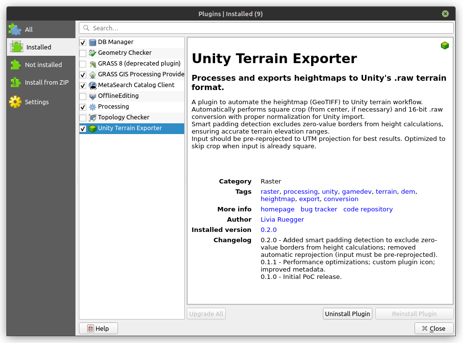
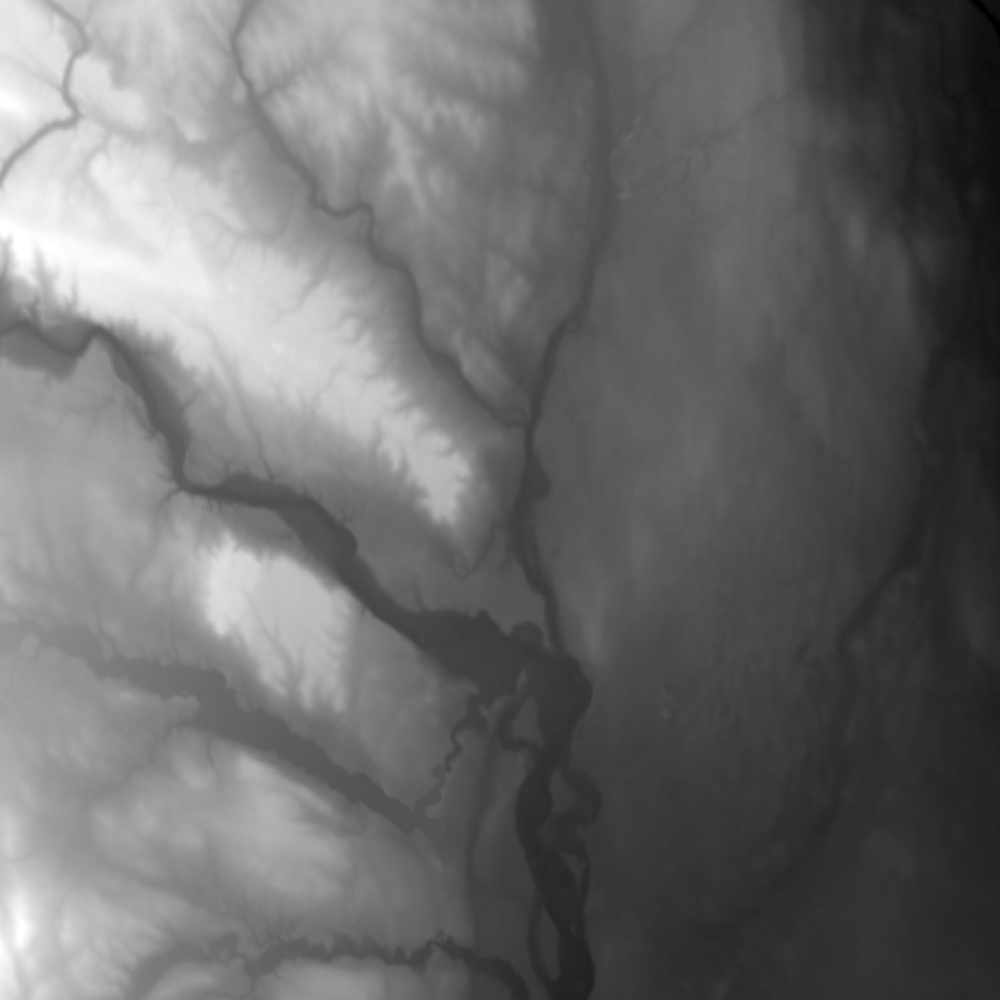
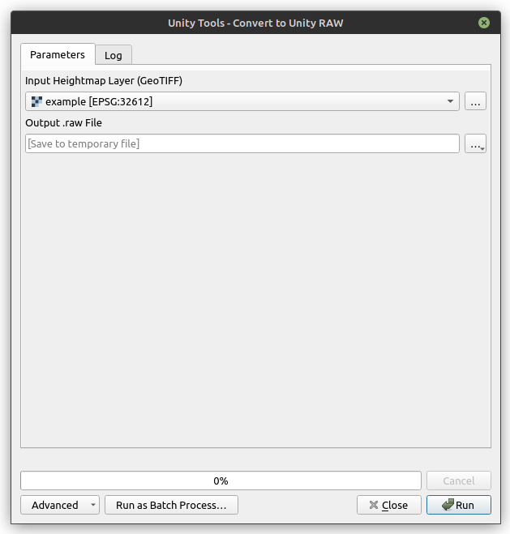
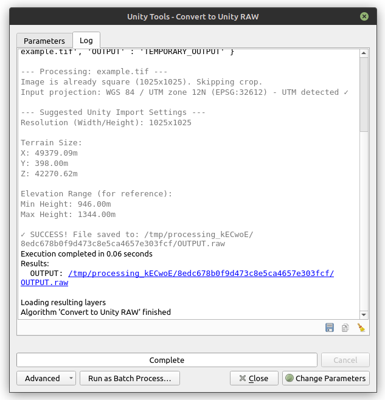
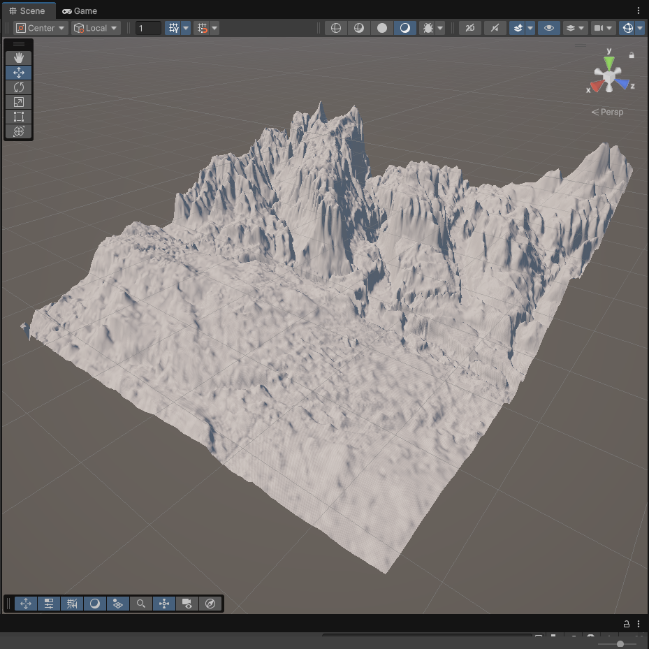

#  Unity Terrain Exporter

**A QGIS plugin to process and export heightmaps (GeoTIFF) directly to Unity terrain format (.raw).**

<!-- *Portuguese version (Versão em português) [available here](README-pt.md).* -->

This plugin provides a tool in the **QGIS Processing Toolbox** that automates the workflow of preparing real-world geospatial data for use in the Unity Engine.

## 🔄 Workflow Overview

The plugin streamlines the entire process from installation to 3D terrain visualization:

  
  
  
  
  

---

## 📖 The Problem

Importing real-world heightmaps into Unity requires handling several technical challenges that most GIS tools don't address:

1.  **Binary Format Requirements:** Unity's `.raw` format has strict specifications:
    - 16-bit Unsigned Integer (0-65535)
    - Little Endian byte order
    - No header - raw binary data only
    - Proper normalization: 0 = minimum height, 65535 = maximum height

2.  **Data Processing:** Real-world geospatial data needs careful handling:
    - Normalization from 32-bit float (GeoTIFF) to 16-bit integer while preserving elevation range
    - Detection and exclusion of padding/NoData values to ensure accurate height calculations
    - Calculation of correct terrain dimensions (X, Y, Z) for Unity's import settings

3.  **Coordinate System Handling:** Accurate terrain dimensions require:
    - Detection of coordinate system (geographic vs. projected)
    - Automatic conversion when needed (e.g., degrees to meters)
    - Handling of non-square pixels after reprojection

**Unity Terrain Exporter** automates all of these technical details into a single, reliable operation.

## ✨ Key Features (v0.2.0)

* **Automatic Square Crop:** Crops the input raster to the largest possible square from its center. *Optimized: skips crop if image is already square.*
* **16-bit RAW Conversion:** Normalizes height data (from 32-bit float to 16-bit integer) and exports it as a Little Endian `.raw` file compatible with Unity's terrain system.
* **Smart Padding Detection:** Automatically detects and excludes zero-value padding in image borders (common after reprojection) from height calculations, ensuring accurate terrain elevation ranges.
* **Projection Validation:** Warns if input is not in UTM projection (recommended for accurate metric scaling in Unity).
* **Detailed Logging:** Calculates and displays suggested **Resolution** and **Terrain Size (X, Y, Z)** values for Unity import settings.

## 🚀 How to Use

### 0. Pre-processing (Recommended)

**Important:** For best results, reproject your heightmap to UTM projection before using this plugin:

1.  In QGIS, right-click your layer > **Export** > **Save As...**
2.  Choose a UTM CRS (e.g., `EPSG:32623` for UTM Zone 23S, or use QGIS's CRS selector to find the correct UTM zone for your area)
3.  Save the reprojected GeoTIFF
4.  Load the reprojected layer into QGIS

**Why UTM?** UTM provides 1:1 metric scaling, ensuring accurate terrain dimensions in Unity. The plugin will warn you if the input is not in UTM, but processing will continue.

### 1. In QGIS
1.  Load your Heightmap (GeoTIFF) into QGIS (preferably already in UTM projection).
2.  Open the **Processing Toolbox** (`Ctrl+Alt+T`).
3.  Go to **Unity Conversion Tools** > **Convert to Unity RAW (Square)**.
4.  Select your input layer and choose a destination for the `.raw` file.
5.  Click **Run**.
6.  **Important:** Check the **Log** tab. You'll see **"Suggested Unity Import Settings"** with:
    * `Resolution (Width/Height)` (e.g., 2049x2049) — **Suggested for Unity's Resolution field**
    * `Terrain Size:` section showing:
      - `X:` (e.g., 98710.00m) — **Suggested for Unity's Terrain Size X**
      - `Y:` (e.g., 1209.00m) — **Suggested for Unity's Terrain Size Y** (elevation range)
      - `Z:` (e.g., 84500.00m) — **Suggested for Unity's Terrain Size Z**
      - *Note: X and Z may differ if pixels are not square (common after reprojection). This is normal and reflects the actual terrain dimensions. Values are in meters for geographic coordinates (automatically converted) and UTM projections. For other projections, units may differ (e.g., feet) - check your projection.*
    * `Elevation Range:` showing Min/Max Height (for reference only)
    * If padding is detected, you'll see a warning message - this is normal and ensures accurate height calculations.

### 2. In Unity
1.  Create a Terrain: `GameObject` > `3D Object` > `Terrain`.
2.  Select the Terrain and go to the **Terrain Settings** (Gear icon) in the Inspector.
3.  Scroll down to "Texture Resolutions (On Terrain Data)" and click **Import Raw...**.
4.  Select your exported `.raw` file.
5.  Configure the import dialog according to the [Unity documentation](https://docs.unity3d.com/6000.2/Documentation/Manual/terrain-Heightmaps.html):
    * **Depth:** Bit 16
    * **Resolution:** Use the `Resolution (Width/Height)` from the log (e.g., 2049 for both width and height)
    * **Byte Order:** Windows (Little Endian)
    * **Flip Vertically:** Usually unchecked (default)
    * **Terrain Size:** This defines the size of the terrain in world units (meters):
      - **X:** Use the `X:` value from the log (e.g., 98710.00m)
      - **Y:** Use the `Y:` value from the log (e.g., 1209.00m)
        - This is the **elevation range** (max - min). Unity assumes minimum = 0 and maximum = Y.
      - **Z:** Use the `Z:` value from the log (e.g., 84500.00m)
      - *Note: If your input is not in UTM, the X and Z values may not be in meters - check the projection. Unity supports non-square terrains (X ≠ Z), which is normal when pixels are not square (common after reprojection).*
6.  Click **Import**.

## 📦 Installation

### Requirements
* **QGIS 3.34 or later**
* Python 3.x (included with QGIS)

### From ZIP (Manual)
1.  Download the latest `.zip` file from the [Releases page](https://github.com/liviaruegger/unity-terrain-exporter/releases/latest).
2.  Open QGIS.
3.  Go to **Plugins** > **Manage and Install Plugins...**.
4.  Select the **Install from ZIP** tab.
5.  Select the downloaded file and click **Install Plugin**.
6.  Restart QGIS if prompted.

## 🎓 Academic Context

This plugin was developed as a **Proof of Concept (PoC)** for a [Capstone Project](https://www.linux.ime.usp.br/~livia/tcc/index.html) of the BSc in Computer Science program at [IME-USP](https://www.ime.usp.br/en/home/).

The project aims to validate the feasibility of automating the interoperability pipeline between open-source geospatial software (QGIS) and 3D engines (Unity).

## ⚖️ License

This project is licensed under the GNU General Public License v3.0 (GPL-3.0) - see the [LICENSE](LICENSE) file for details. This license is recommended for QGIS plugins as it ensures compatibility with QGIS's own GPL license.