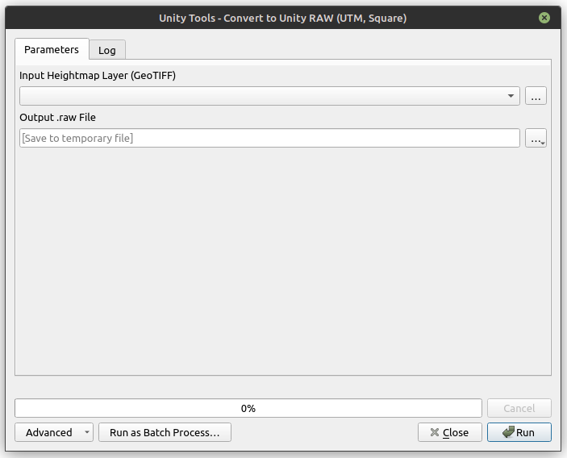

# Unity Terrain Exporter

<!--  -->

**A QGIS plugin to process and export heightmaps (GeoTIFF) directly to Unity terrain format (.raw).**

<!-- *Portuguese version (Versão em português) [available here](README-pt.md).* -->

This plugin provides a tool in the **QGIS Processing Toolbox** that automates the workflow of preparing real-world geospatial data for use in the Unity Engine.

---

## 📖 The Problem

Importing real-world heightmaps into Unity is often a manual and error-prone process:
1.  **Shape:** GIS data is rarely perfectly square, while Unity requires square textures.
2.  **Format:** Unity requires a specific binary format (`.raw`, 16-bit Unsigned Integer, Little Endian) that most GIS tools do not export natively.

**Unity Terrain Exporter** automates this entire pipeline into a single operation.

## ✨ Key Features (v0.1.0)

* **Automatic Square Crop:** Crops the input raster to the largest possible square from its center. *Optimized: skips crop if image is already square.*
* **Automatic UTM Reprojection:** Detects the correct UTM zone based on the raster's location and reprojects it to ensure 1:1 metric scaling. *Optimized: skips reprojection if already in UTM.*
* **16-bit RAW Conversion:** Normalizes height data (from 32-bit float to 16-bit integer) and exports it as a Little Endian `.raw` file.
* **Detailed Logging:** Calculates and displays the specific **Resolution** and **Height Variation** values needed for the Unity import settings.

---

## 🚀 How to Use

### 1. In QGIS
1.  Load your Heightmap (GeoTIFF) into QGIS.
2.  Open the **Processing Toolbox** (`Ctrl+Alt+T`).
3.  Go to **Unity Conversion Tools** > **Convert to Unity RAW (UTM, Square)**.
4.  Select your input layer and choose a destination for the `.raw` file.
5.  Click **Run**.
6.  **Important:** Check the **Log** tab. Note down the values for:
    * `Final Resolution` (e.g., 2049x2049)
    * `Terrain Height (Variation)` (e.g., 1500.50m)

### 2. In Unity
1.  Create a Terrain: `GameObject` > `3D Object` > `Terrain`.
2.  Select the Terrain and go to the **Terrain Settings** (Gear icon) in the Inspector.
3.  Scroll down to "Texture Resolutions (On Terrain Data)" and click **Import Raw...**.
4.  Select your exported `.raw` file.
5.  Configure the import using the values from the QGIS Log:
    * **Depth:** Bit 16
    * **Byte Order:** Windows (Little Endian)
    * **Width / Height:** (Use the `Final Resolution` from the log, e.g., 2049)
    * **Terrain Height:** (Use the `Terrain Height (Variation)` from the log, e.g., 1500.50)
6.  Click **Import**.

---

## 📦 Installation

### Requirements
* **QGIS 3.34 or later**
* Python 3.x (included with QGIS)

### From ZIP (Manual)
1.  Download the latest `.zip` file from the [Releases page](https://github.com/liviaruegger/unity-terrain-exporter/releases/latest).
2.  Open QGIS.
3.  Go to **Plugins** > **Manage and Install Plugins...**.
4.  Select the **Install from ZIP** tab.
5.  Select the downloaded file and click **Install Plugin**.
6.  Restart QGIS if prompted.

---

## 🎓 Academic Context

This plugin was developed as a **Proof of Concept (PoC)** for a Capstone Project (Trabalho de Conclusão de Curso - TCC) at [IME-USP](https://www.ime.usp.br/en/home/).

The project aims to validate the feasibility of automating the interoperability pipeline between open-source geospatial software (QGIS) and 3D engines (Unity).

## ⚖️ License

This project is licensed under the MIT License - see the [LICENSE](LICENSE) file for details.